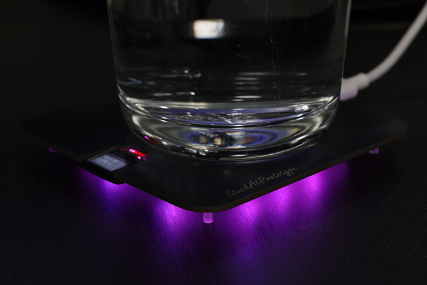

# PCB Coaster - StuckAtPrototype

## Youtube Video
A bit of a back-story of how this project came to be. 

Sub if you like what you see.

*Some pictures of the project*

## Project Structure
The project consists of
1. Firmware
2. Hardware
3. Mechanical

These are structured into their own files. I could have used submodules, but decided against it.  

### 1. Firmware
Code for the coaster. This lives on the ESP32

#### Requirements
- ESP32 IDF version 5.4
- Target set to ESP32-H2
- Install managed components  

##### Required Managed Components
1. lvgl 
2. espressif esp lvgl port

### 2. Hardware

#### Schematic
PDF schematic included for your viewing pleasure. File `PCB_Coaster_v0.2_Schematic.pdf`

#### PCBs
All the gerber files you'd need to send to a fab house. File `PCB coaster v0.2.zip`

#### BOM
Bill of materials file `coaster-BOM-v0.2.csv`

#### Kicad
All the files you'd need to expand and work on this further. If you'd like.

### 3. Mechanical

#### Diffuser
`PCB Coaster diffuser.step`
You can print this part with clear ABS fillament for best results. 

#### Screen Holder
`PCB Coaster screen holder.step`
I printed this part with an SLA printer, it can probably do ok with a filament printer too 

#### Spacers
`PCB Coaster spacer.step`
These print best on SLA. Filament printer will not achieve flat tops, though it might work. Best printed with SLA.  

#### Screen protector
I used a Cricut machine and a thin accental plastic to cut out the screen protector. Ideally, this would be made of tempered glass. (maybe one day)

## If you take it further
Let me know if you ever make one of these, I'd love to see it. Seriously, that'd be exciting and inspiring to keep making my projects open source!

## And if you got this far...
Consider signing up for my mailing list. As I run into problems when making these projects, I fire off an email with a small write up explaing the problem and the solution I found. Here is the link https://landing.stuckatprototype.com/exclusive

Stay fun, StuckAtPrototype

---
## License
### Apache 2.0 -- i.e. use as you'd like
http://www.apache.org/licenses/LICENSE-2.0
